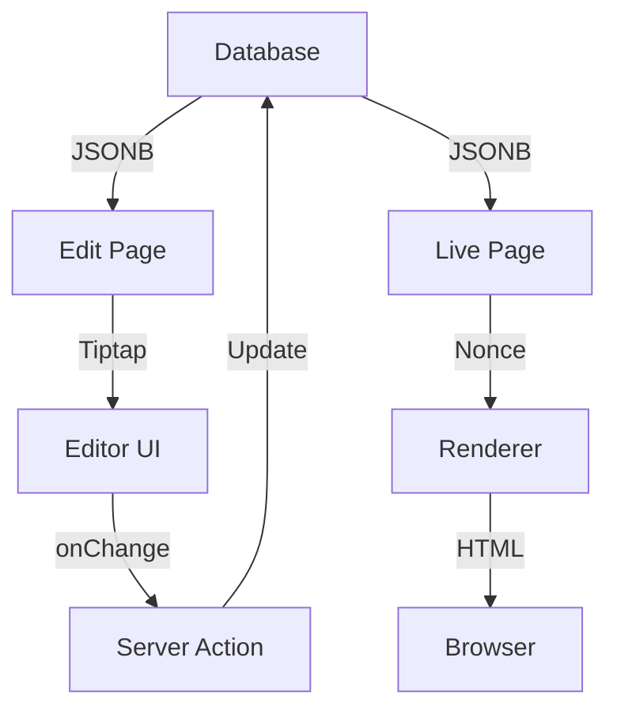

# NextBlock™ Editor System

## 1. Overview

The NextBlock™ Editor is a dual-layer system:

1.  **Block Layout:** A structured `JSONB` format for Sections, Columns, and layout blocks.
2.  **Rich Text (Tiptap):** A Notion-style Tiptap v3 editor for text content within blocks.

This document covers the data structure, the Tiptap integration, and the runtime security context (CSP).

---

## 2. Block Layout System

### Data Structure (`apps/nextblock/lib/blocks/blockRegistry.ts`)

- **Registry:** Single source of truth for all block types (`section`, `text`, `hero`, etc.).
- **Storage:** Saved as `JSONB` in the `blocks` table.
- **Hierarchy:** `SectionBlock` -> `Column` -> `Block[]`.

### Key Components

- **`BlockEditorArea.tsx`:** The main orchestrator in the Admin UI.
- **`SectionBlockEditor.tsx`:** Handles drag-and-drop columns (dnd-kit).
- **`DynamicNestedBlockRenderer.tsx`:** Lazy-loads renderers for the live site.

### Optimistic UI & Data Persistence

To provide a snappy experience, the editor uses an **optimistic UI** pattern:

- **State:** `BlockEditorArea.tsx` maintains the master state using `useOptimistic`. UI updates instantly.
- **Persistence:** Changes are auto-saved via a **debounced** Server Action (`updateBlock`).
- **No Revalidation:** The action _does not_ calls `revalidatePath` to avoid disruptive page reloads while typing.

### Component Architecture

#### 1. `BlockEditorArea.tsx`

The root orchestrator. Fetches initial data, manages global state, and provides the top-level `DndContext`.

#### 2. `SortableBlockItem.tsx` & `EditableBlock.tsx`

Wrappers that provide drag handles and the "Edit" interface.

- **Logic:** Clicking "Edit" on a complex block (Section/Hero) toggles an inline panel. For simple blocks, it opens the `BlockEditorModal`.

#### 3. `BlockEditorModal.tsx`

A reusable dialog that lazy-loads the specific editor component (e.g., `ButtonBlockEditor`) inside a `Suspense` boundary. It handles temporary state during editing.

#### 4. `SectionBlockEditor.tsx`

Manages multi-column layouts. Contains `ColumnEditor` components which have their own nested `DndContext`.

---

## 3. Tiptap v3 Implementation (`libs/editor`)

The rich-text editor is a separate library (`@nextblock-cms/editor`) shared by the App and CLI templates.

### Core Extensions (`libs/editor/src/lib/kit.ts`)

- **StarterKit:** Standard formatting (Bold, Italic, Lists).
- **Custom Nodes:**
  - `DivNode` & `PreserveAllAttributes`: Preserves HTML layout from pasted content.
  - `ScriptTagNode`: Safely handles script tags (see CSP below).
  - `StyleTagNode`: Visual placeholder for `<style>` tags.

### UI Components

- **`NotionEditor.tsx`:** The main entry point. `"use client"`.
- **`Toolbar.tsx`:** Floating formatting toolbar.
- **Menus:** Slash Command (`/`), Bubble Menu (selection), Floating Menu (empty line).

---

## 4. Runtime & Security (CSP)

### Content Security Policy

NextBlock™ uses a strict Nonce-based CSP in production.

- **Middleware (`middleware.ts`):** Generates a nonce per request.
- **Renderer (`TextBlockRenderer.tsx`):** Injects the nonce into inline `<script>` tags.
- **Preview:** The Editor uses a sandboxed `iframe` with `blob:` URLs to safely preview scripts and styles without executing them in the main Admin context.

### Data Flow

---

## 5. Reference: Available Blocks

All blocks are defined in `apps/nextblock/lib/blocks/blockRegistry.ts`.

| Block Type       | Description                             | Use Cases                  |
| :--------------- | :-------------------------------------- | :------------------------- |
| **Rich Text**    | WYSIWYG editor for HTML content.        | Articles, Body Text, Lists |
| **Heading**      | Semantic headings (H1-H6).              | Page Titles, Sections      |
| **Image**        | Optimized images with caption/alt text. | Photos, Diagrams           |
| **Button**       | CTA buttons with style variants.        | Links, Downloads           |
| **Posts Grid**   | Dynamic grid of blog posts.             | Blog Index, News           |
| **Video Embed**  | YouTube/Vimeo embeds.                   | Tutorials, Promos          |
| **Section**      | Container with responsive columns.      | Layouts, Grids             |
| **Hero**         | Specialized top-of-page banner.         | Homepage Intro             |
| **Form**         | Contact/Lead gen forms.                 | Contact Pages              |
| **Testimonial**  | Customer quotes and reviews.            | Social Proof               |
| **Product Grid** | E-Commerce product listing.             | Shop Pages                 |
| **Cart**         | Shopping cart interface.                | Checkout Flow              |
